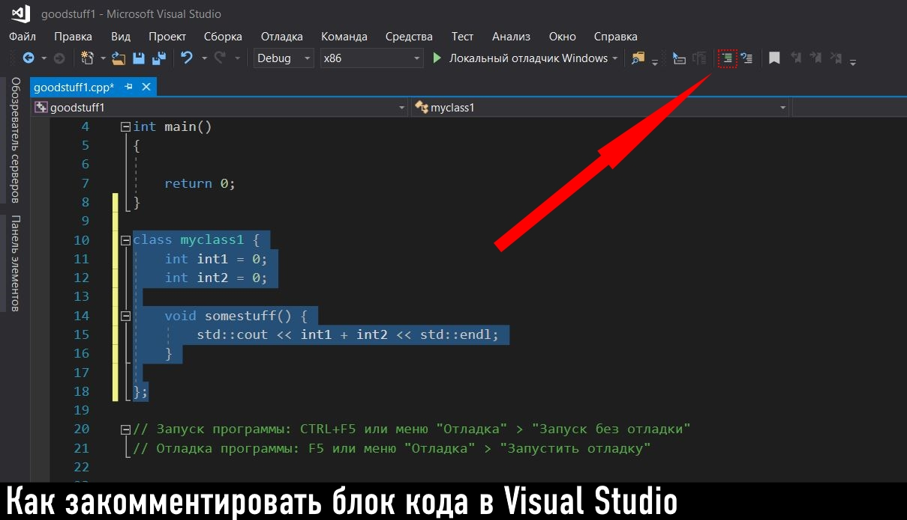
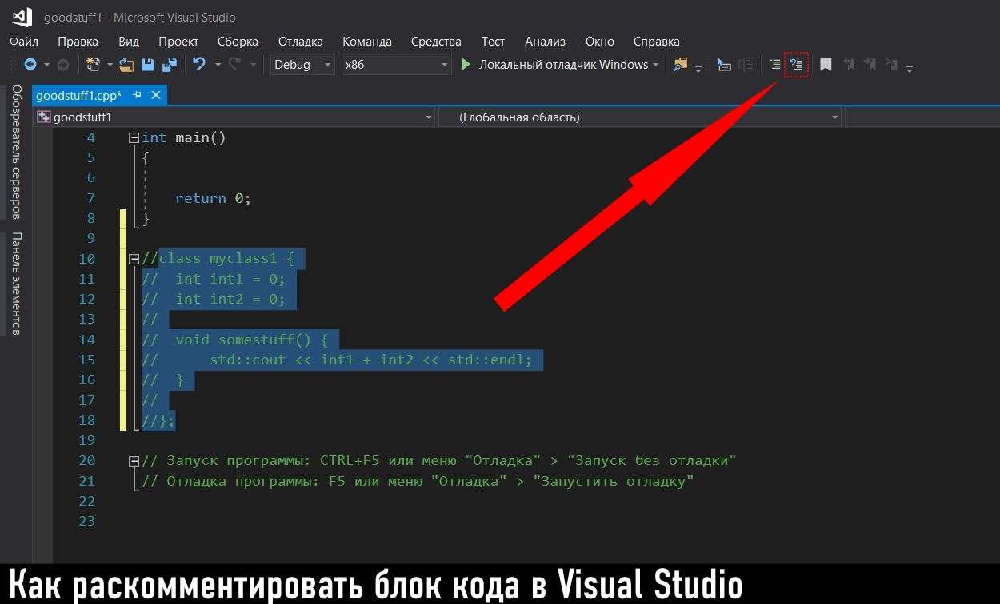
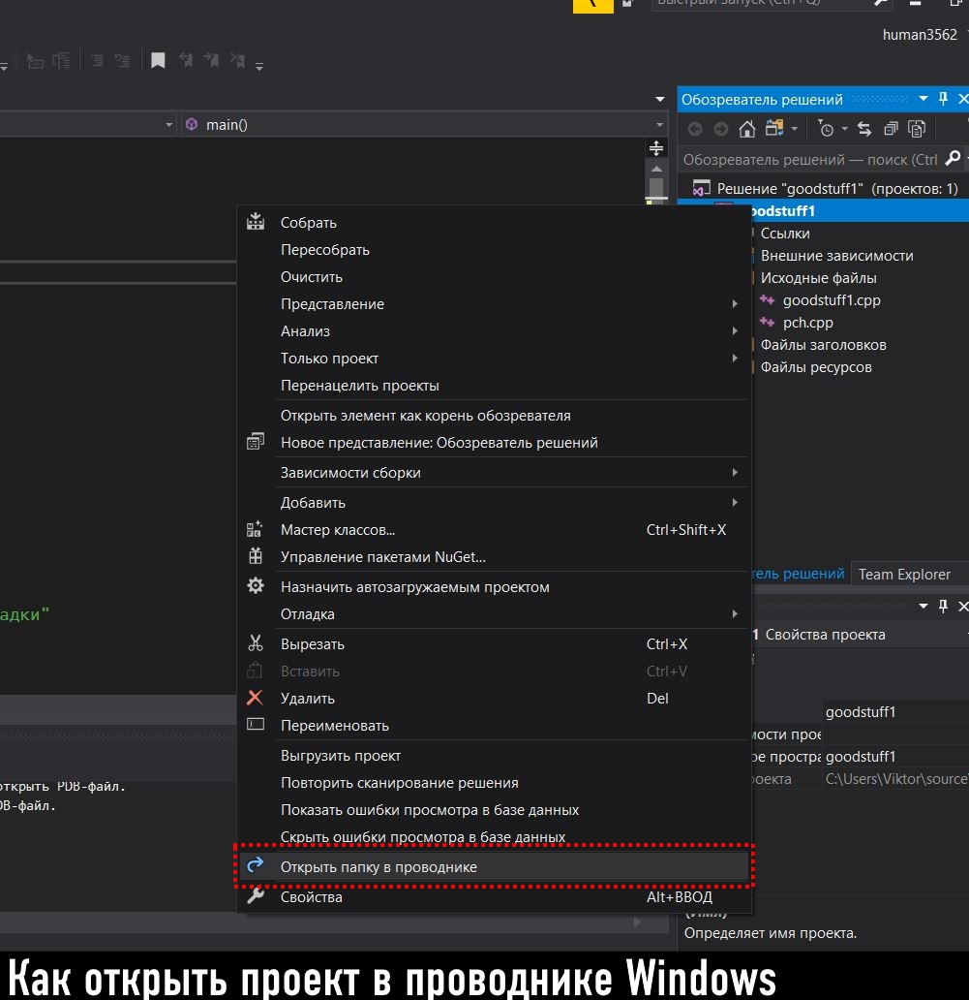
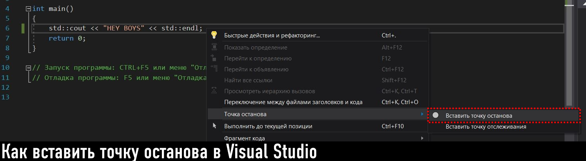
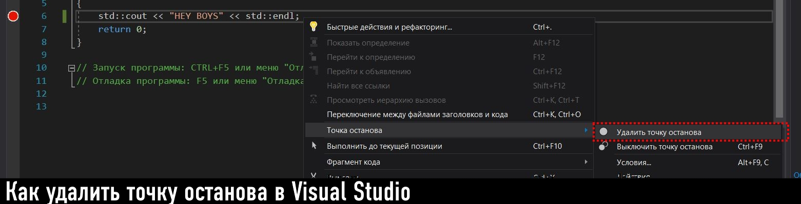

МИНИСТЕРСТВО НАУКИ  И ВЫСШЕГО ОБРАЗОВАНИЯ РОССИЙСКОЙ ФЕДЕРАЦИИ  
Федеральное государственное автономное образовательное учреждение высшего образования  
"КРЫМСКИЙ ФЕДЕРАЛЬНЫЙ УНИВЕРСИТЕТ им. В. И. ВЕРНАДСКОГО"  
ФИЗИКО-ТЕХНИЧЕСКИЙ ИНСТИТУТ  
Кафедра компьютерной инженерии и моделирования
<br/><br/>
​
### Отчёт по лабораторной работе № 1<br/> по дисциплине "Программирование"
<br/>
​
студента 1 курса группы ПИ-б-о-192(1)  
Денисенко Виктор Андреевич
направления подготовки 09.03.04 "Программная инжерения"  
<br/>
​
<table>
<tr><td>Научный руководитель<br/> старший преподаватель кафедры<br/> компьютерной инженерии и моделирования</td>
<td>(оценка)</td>
<td>Чабанов В.В.</td>
</tr>
</table>
<br/><br/>
​
Симферополь, 2019

### Лабораторная работа № 1
Цель: изучить основные возможности создания и отладки программ в IDE MS Visual Studio.
<br/>
Ход работы
<br/>

### №1 Как создать консольное приложение C++?
- Для создания консольного приложения C++ следует выполнить следующие действия: 
Файл -> Создать -> Проект...


- В появившемся окне следует выбрать вкладку "Visual C++", затем в списке выбрать "Консольное приложение Windows", дать имя проекту в графе "Имя", задать расположение и нажать кнопку "ОК".

<br/>

### №2 Как изменить цветовую схему (оформление) среды?
- Для изменения цветовой схемы Visual Studio следует выполнить следующие действия:
Средства -> Параметры -> Общие -> Цветовая тема


<br/>

### №3 Как закомментировать/раскомментировать блок кода средствами VS?
- Для комментирования/раскомментирования блока кода следует выделить строки, которые вы хотите закомментировать или раскомментировать и нажать на соответствующую кнопку (см. скриншоты)


<br/>

### №4 Как открыть в проводнике Windows папку с проектом средствами VS?
- Для открытия в проводнике проекта Visual Studio следует нажать правой кнопкой мыши по проекту в обозревателе решений и выбрать "Открыть папку в проводнике"

<br/>

### №5 Какое расширение файла-проекта используется в VS?
- В Visual Studio файл проекта использует расширение ".sln" (Visual Studio Solution)
<br/>

### №6 Как запустить код без отладки (не менее 2 способов)?
- Для того чтобы запустить код без отладки следует нажать сочетание клавиш CTRL + F5 или меню "Отладка" -> "Запуск без отладки".
<br/>

### №7 Как запустить код в режиме отладки (не менее 2 способов)?
- Для того чтобы запустить код в режиме отладки следует нажать F5 или меню "Отладка" -> "Запустить отладку".
<br/>

### №8 Как установить/убрать точку останова (breakpoint)?
- Для установки/удаления точки останова следует выбрать строку на которой вы хотите установить или удалить точку останова, нажать правой кнопкой мыши и выбрать "Точка останова" -> "Вставить точку останова" или "Удалить точку останова".


<br/>

### №9 Создать программу со следующим кодом:
```cpp
#include <iostream>

int main() {
  int i;
  i = 5; //Точка останова 1
  std::cout << i; //Точка останова 2
  return 0;
}
```
- Какое значение содержит переменная i в 5й строке? <br/>
В строке 5 переменная i имеет значение -858993460
<br/> <br/>
- Какое значение содержит переменная i в 5й строке? <br/>
В строке 6 переменная i имеет значение 5
<br/>

### №10 Выполнить задание 9 изменив программу на следующую:
```cpp
#include <iostream>

int main() {
  double i;
  i = 5; //Точка останова 1
  std::cout << i; //Точка останова 2
  return 0;
}
```
- Какое значение содержит переменная i в 5й строке? <br/>
В строке 5 переменная i имеет значение -9.2559631349317831e+61
<br/> <br/>
- Какое значение содержит переменная i в 5й строке? <br/>
В строке 6 переменная i имеет значение 5.0000000000000000
<br/>

### Вывод: изучил основные возможности создания и отладки программ в IDE MS Visual Studio, закрепил свои знания на практике.
