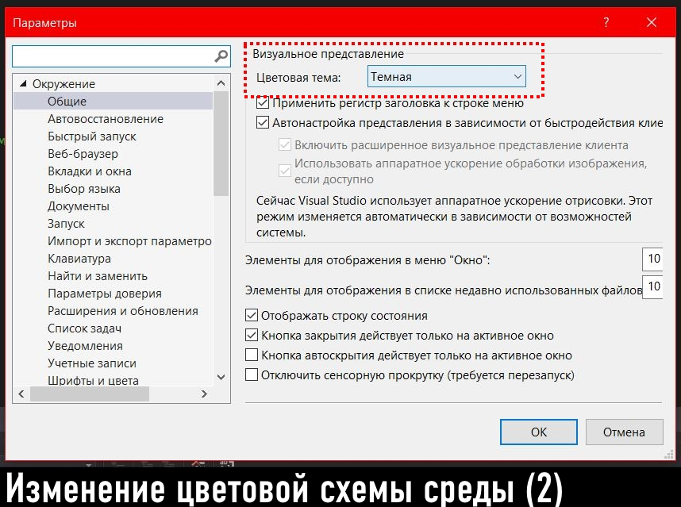

МИНИСТЕРСТВО НАУКИ  И ВЫСШЕГО ОБРАЗОВАНИЯ РОССИЙСКОЙ ФЕДЕРАЦИИ  
Федеральное государственное автономное образовательное учреждение высшего образования  
"КРЫМСКИЙ ФЕДЕРАЛЬНЫЙ УНИВЕРСИТЕТ им. В. И. ВЕРНАДСКОГО"  
ФИЗИКО-ТЕХНИЧЕСКИЙ ИНСТИТУТ  
Кафедра компьютерной инженерии и моделирования
  
​
### Отчёт по лабораторной работе № 1  по дисциплине "Программирование"
 
​
студента 1 курса группы ПИ-б-о-192(1)  
Денисенко Виктор Андреевич
направления подготовки 09.03.04 "Программная инжерения"  
 
​
<table>
<tr><td>Научный руководитель  старший преподаватель кафедры  компьютерной инженерии и моделирования</td>
<td>(оценка)</td>
<td>Чабанов В.В.</td>
</tr>
</table>
  
​
Симферополь, 2019

### Лабораторная работа № 1
Цель: изучить основные возможности создания и отладки программ в IDE MS Visual Studio.
 
Ход работы
 

### №1 Как создать консольное приложение C++?
- Для создания консольного приложения C++ следует выполнить следующие действия: 
Файл -> Создать -> Проект...

- В появившемся окне следует выбрать вкладку "Visual C++", затем в списке выбрать "Консольное приложение Windows", дать имя проекту и нажать кнопку "ОК".

 

### №2 Как изменить цветовую схему (оформление) среды?
- Для изменения цветовой схемы Visual Studio следует выполнить следующие действия:
Средства -> Параметры -> Общие -> Цветовая тема

 

### №3 Как закомментировать/раскомментировать блок кода средствами VS?
-
