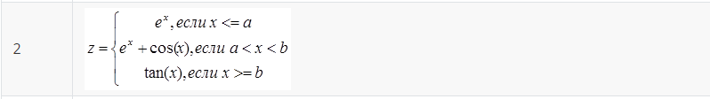
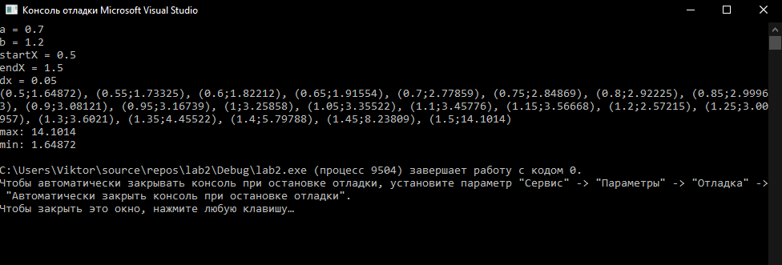
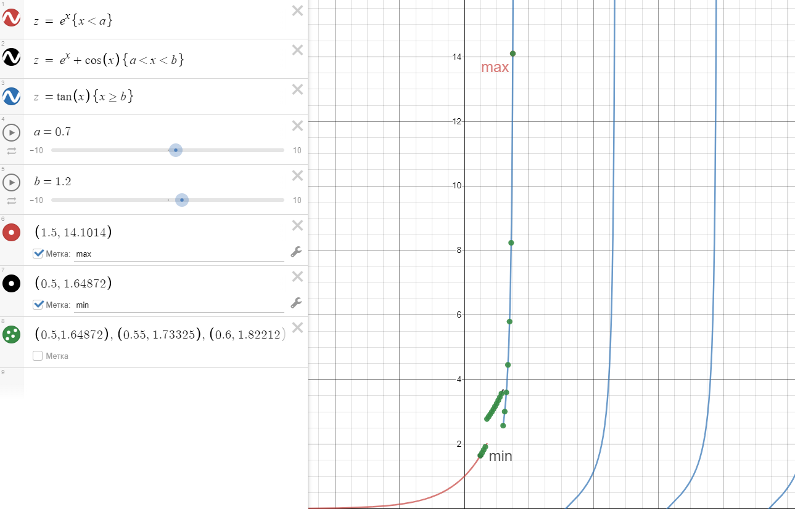

МИНИСТЕРСТВО НАУКИ И ВЫСШЕГО ОБРАЗОВАНИЯ РОССИЙСКОЙ ФЕДЕРАЦИИ
Федеральное государственное автономное образовательное учреждение высшего образования
"КРЫМСКИЙ ФЕДЕРАЛЬНЫЙ УНИВЕРСИТЕТ им. В. И. ВЕРНАДСКОГО"
ФИЗИКО-ТЕХНИЧЕСКИЙ ИНСТИТУТ
Кафедра компьютерной инженерии и моделирования
<br/><br/>
​
### Отчёт по лабораторной работе № 2<br/> по дисциплине "Программирование"
<br/>

студента 1 курса группы ПИ-б-о-192(1)\
Денисенко Виктора Андреевича\
направления подготовки 09.03.04 "Программная инженерия"
<br/>
​
<table>
<tr><td>Научный руководитель<br/> старший преподаватель кафедры<br/>компьютерной инженерии и моделирования</td>
<td>(оценка)</td>
<td>Чабанов В.В.</td>
</tr>
</table>
<br/><br/>
​
Симферополь, 2019

* * *

## Цель:
1. Овладеть практическими навыками разработки и программирования вычислительного процесса циклической структуры;
2. Сформировать навыков программирования алгоритмов разветвляющейся структуры;
3. Изучить операторы ветвления. Особенности использования полной и сокращенной формы оператора if и тернарного оператора.

## Ход работы:
Написал на языке C++ программу, которая для функции f(x) на определенном интервале выводит в консоль: значения f(x) с шагом dx; 
максимальное и минимальное значение функции на интервале. 



*Рис.1 Необходимая функция*

* * *

```cpp
#include "pch.h"
#include <iostream>
#include <math.h>

using namespace std;

double a, b, startX, endX, dx;

double f(double x) {
	if (x <= a) {
		return exp(x);
	}
	else if (x < b && x > a) {
		return exp(x) + cos(x);
	}
	else if (x >= b) {
		return tan(x);
	}
}

int main()
{
	cout << "a = ";
	cin >> a;

	cout << "b = ";
	cin >> b;

	cout << "startX = ";
	cin >> startX;
	
	cout << "endX = ";
	cin >> endX;

	cout << "dx = ";
	cin >> dx;

	double firstval = f(startX);
	cout << '('<<startX<<';'<<firstval<<')';
	double max = firstval;
	double min = firstval;

	for (double i = startX+dx; i <= endX+dx; i += dx) {
		double val = f(i);
		cout << ", (" << i << ';' << val << ')';
		if (val > max) max = val;
		if (val < min) min = val;
	}


	cout << endl;
	cout << "max: " << max << endl;
	cout << "min: " << min << endl;

	return 0;
}
```
Запустил программу, ввел необходимые начальные данные и вписал вывод в таблицу:

x    | f
-----|-----
0.5  | 1.64872
0.55 | 1.73325
0.6  | 1.82212
0.65 | 1.91554
0.7  | 2.77859
0.75 | 2.84869
0.8  | 2.92225
0.85 | 2.99963
0.9  | 3.08121
0.95 | 3.16739
1    | 3.25858
1.05 | 3.35522
1.1  | 3.45776
1.15 | 3.56668
1.2  | 2.57215
1.25 | 3.00957
1.3  | 3.6021
1.35 | 4.45522
1.4  | 5.79788
1.45 | 8.23809
1.5  | 14.1014

*Таблица 1. Вывод программы*

__Min__: 1.64872
__Max__: 14.1014



*Рис.2 Вывод программы*

Используя https://www.desmos.com/calculator построил график функции (Рис.1), добавил на график точки, получившиеся в процессе табуляции.
Добавил на график точки минимума и максимума.



*Рис.3 Построение графика*

* * *

## Вывод

Я овладел практическими навыками разработки и программирования вычислительного процесса циклической структуры, сформировал навыки программирования алгоритмов разветвляющейся структуры, изучил операторы ветвления, особенности использования полной и сокращенной формы оператора if и тернарного оператора.
