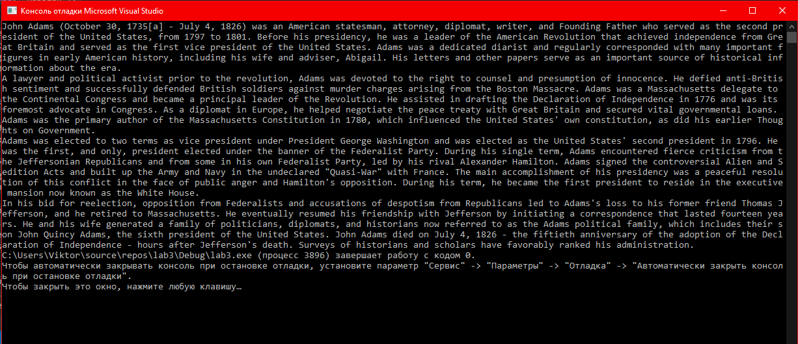

МИНИСТЕРСТВО НАУКИ И ВЫСШЕГО ОБРАЗОВАНИЯ РОССИЙСКОЙ ФЕДЕРАЦИИ
Федеральное государственное автономное образовательное учреждение высшего образования
"КРЫМСКИЙ ФЕДЕРАЛЬНЫЙ УНИВЕРСИТЕТ им. В. И. ВЕРНАДСКОГО"
ФИЗИКО-ТЕХНИЧЕСКИЙ ИНСТИТУТ
Кафедра компьютерной инженерии и моделирования
<br/><br/>
​
### Отчёт по лабораторной работе № 3<br/> по дисциплине "Программирование"
<br/>

студента 1 курса группы ПИ-б-о-192(1)\
Денисенко Виктора Андреевича\
направления подготовки 09.03.04 "Программная инженерия"
<br/>
​
<table>
<tr><td>Научный руководитель<br/> старший преподаватель кафедры<br/>компьютерной инженерии и моделирования</td>
<td>(оценка)</td>
<td>Чабанов В.В.</td>
</tr>
</table>
<br/><br/>
​
Симферополь, 2019

* * *

## Цель:
1. Закрепить навыки разработки программ использующих операторы цикла;
2. Закрепить навыки разработки программ использующих массивы;
3. Освоить методы подключения сторонних библиотек.

## Ход работы
1. Скачал и подключил <a href="https://github.com/marc-q/libbmp">библиотеку для работы с изображениями формата bmp.</a>
2. Написал программу для декодирования сообщения из картинки:<br/>
### Мой ключ: 00r 00g 00b 10r 10g 10b 01r 01g.<br/>
### Моя картинка:


*Рис.1 Картинка с закодированным сообщением*

### Код программы:
```c++
#include <iostream>
#include "libbmp.h"

//00r 00g 00b 10r 10g 10b 01r 01g

int main()
{
	setlocale(LC_ALL, "Russian");

	BmpImg img;
	img.read("codedImage.bmp");
	const int width = img.get_width() - 1;
	const int height = img.get_height() - 1;
	char text[4000] = {};

	int pos = 0;
	bool isEnd = false;

	for (int y = 0; y <= height; y++){
		for (int x = 0; x <= width; x++){

			char rbit = img.red_at(x, y)   & 1;
			char gbit = img.green_at(x, y) & 1;
			char bbit = img.blue_at(x, y)  & 1;

			text[pos / 8] |= rbit << (7-(pos % 8));
			pos++;
			if (text[pos/8] == '\0' && pos % 8 == 7) {
				isEnd = true;
			}

			text[pos / 8] |= gbit << (7-(pos % 8));
			pos++;
			if (text[pos / 8] == '\0' && pos % 8 == 7) {
				isEnd = true;
			}

			text[pos / 8] |= bbit << (7-(pos % 8));
			pos++;
			if (text[pos / 8] == '\0' && pos % 8 == 7) {
				isEnd = true;
			}

			if (isEnd) break;
		}
		if (isEnd) break;
	}
	std::cout << text;

	return 0;
}
```
### Результат выполнения программы:



*Рис.2 Вывод программы*

## Вывод:
Закрепил навыки разработки программ использующих операторы цикла. 
Закрепил навыки разработки программ использующих массивы. 
Освоил методы подключения сторонних библиотек.
