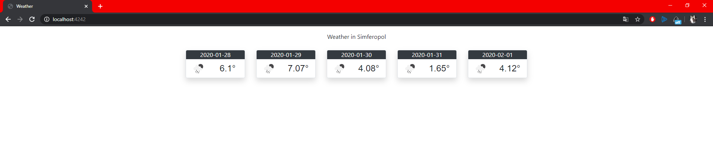

МИНИСТЕРСТВО НАУКИ И ВЫСШЕГО ОБРАЗОВАНИЯ РОССИЙСКОЙ ФЕДЕРАЦИИ
Федеральное государственное автономное образовательное учреждение высшего образования
"КРЫМСКИЙ ФЕДЕРАЛЬНЫЙ УНИВЕРСИТЕТ им. В. И. ВЕРНАДСКОГО"
ФИЗИКО-ТЕХНИЧЕСКИЙ ИНСТИТУТ
Кафедра компьютерной инженерии и моделирования
<br/><br/>
​
### Отчёт по лабораторной работе № 6<br/> по дисциплине "Программирование"
<br/>

студента 1 курса группы ПИ-б-о-192(1)\
Денисенко Виктора Андреевича\
направления подготовки 09.03.04 "Программная инженерия"
<br/>
​
<table>
<tr><td>Научный руководитель<br/> старший преподаватель кафедры<br/>компьютерной инженерии и моделирования</td>
<td>(оценка)</td>
<td>Чабанов В.В.</td>
</tr>
</table>
<br/><br/>
​
Симферополь, 2019

* * *

## Цель:
1. Закрепить навыки разработки многофайловыx приложений;
2. Изучить способы работы с API web-сервиса;
3. Изучить процесс сериализации/десериализации данных.

## Ход работы:

Следуя рекомендациям методички выполнил все поставленные задания и написал работающую программу.

Мой ключ API: bde4a344907083d6f10319df852bcc89

Полный код программыы: 

```c++
#include <iostream>
#include <fstream>
#include <string>
#include <httplib/httplib.h>
#include <nlohmann/json.hpp>

using namespace httplib;
using json = nlohmann::json;

//SIMFEROPOL - 693805
//API key - bde4a344907083d6f10319df852bcc89

void gen_response(const Request& req, Response& res) {
	
	//openweathermap.org:80/data/2.5/forecast?id=693805&APPID=bde4a344907083d6f10319df852bcc89&units=metric

	httplib::Client cli("api.openweathermap.org", 80);

	auto resp = cli.Get("/data/2.5/forecast?id=693805&APPID=bde4a344907083d6f10319df852bcc89&units=metric");
	//std::cout << resp->body;
	if (resp && resp->status == 200) {
		//res.set_content(resp->body, "text/plain");
		json result = json::parse(resp->body);
		std::cout << result["cod"];

		std::ifstream fin("Weather.html");
		std::string output = "could not load template :(";

		if (!fin.is_open()) {
			std::cout << "Ошибка при открытии макета." << std::endl;
			fin.close();
		}
		else {
			output = "";
			char ch;
			while (fin.get(ch)) {
				output += ch;
			}
			
			std::string name = "{city.name}";
			output.replace(output.find(name), name.length(), result["city"]["name"]);

			std::string dt = "{list.dt}";
			std::string temp = "{list.main.temp}";
			std::string icon = "{list.weather.icon}";

			std::string date_check = "";
			std::cout << result["list"].size()<< std::endl;
			std::cout << result["list"][1]["main"]["temp"];
			std::cout << result["list"][1]["weather"][0]["icon"].dump() << std::endl;
			int amt = result["list"].size();
			for (int i = 0; i < result["list"].size(); i++) {
				if (output.find(dt) != std::string::npos) {
					if (result["list"][i]["dt_txt"].dump().substr(1,11) != date_check) {
						output.replace(output.find(dt), dt.length(), result["list"][i]["dt_txt"].dump().substr(1,11));
						
						if (output.find(temp) != std::string::npos) {
							output.replace(output.find(temp), temp.length()+1, result["list"][i]["main"]["temp"].dump());
						}

						if (output.find(icon) != std::string::npos) {
							std::string iconid = result["list"][1]["weather"][0]["icon"].dump();
							std::string url = "http://openweathermap.org/img/wn/"+(iconid.substr(1,iconid.size()-2)+".png");
							
							output.replace(output.find(icon), icon.length(), url);
						}

						date_check = result["list"][i]["dt_txt"].dump().substr(1,11);
						std::cout <<" "<< i << std::endl;
					}
				}
			}

		}
		
		res.set_content(output, "text/html");
	}
	else {
		res.set_content("somethings wrong, i can feel it", "text/text");
	}
}


int main(void) {
	setlocale(LC_ALL, "Russian");
	Server svr;                    // Создаём сервер (пока-что не запущен)
	svr.Get("/", gen_response);    // Вызвать функцию gen_response если кто-то обратиться к корню "сайта"
	svr.listen("localhost", 4242); // Запускаем сервер на localhost и порту 1234
}
```

Скриншот с демонстрацией работы программы:



*Рис.1 Работа программы*
