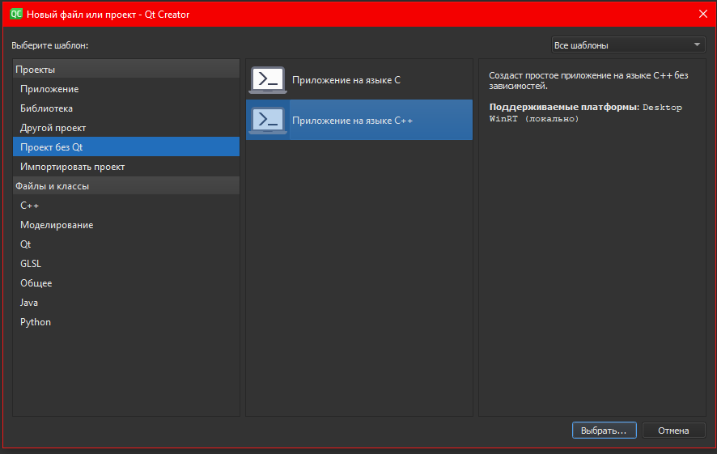
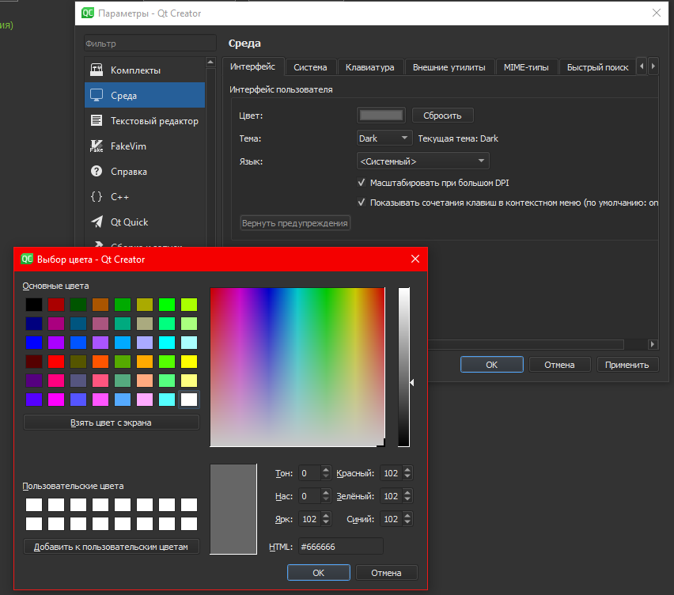
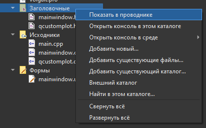
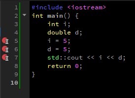
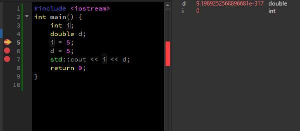
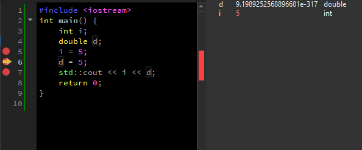
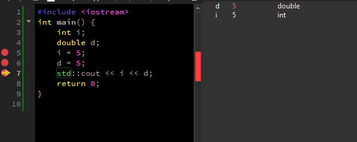
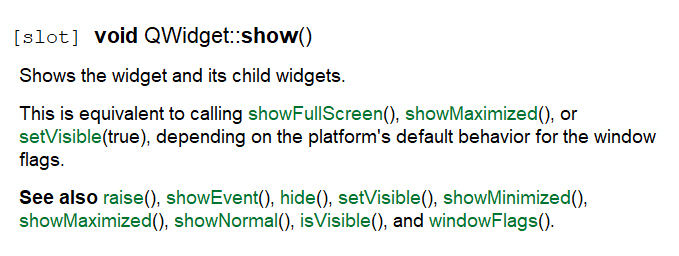
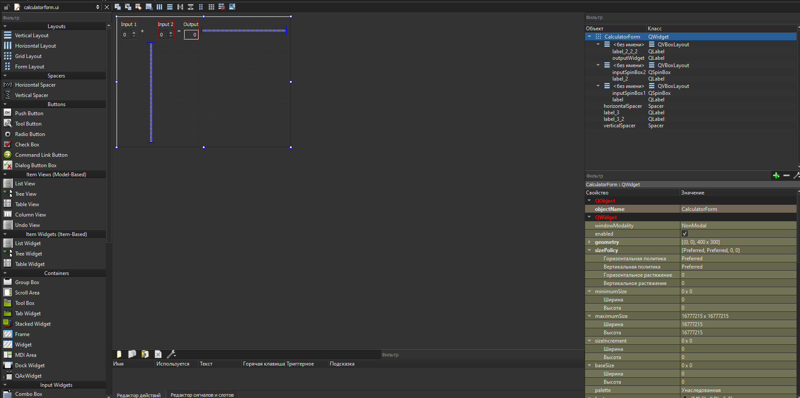
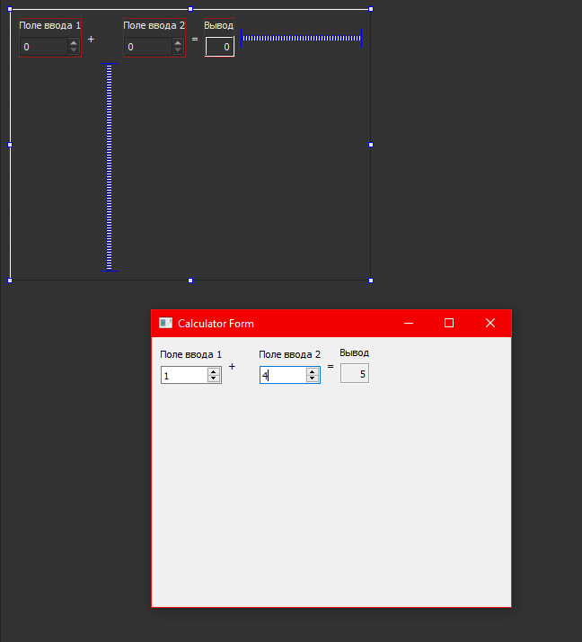

МИНИСТЕРСТВО НАУКИ  И ВЫСШЕГО ОБРАЗОВАНИЯ РОССИЙСКОЙ ФЕДЕРАЦИИ  

Федеральное государственное автономное образовательное учреждение высшего образования  

"КРЫМСКИЙ ФЕДЕРАЛЬНЫЙ УНИВЕРСИТЕТ им. В. И. ВЕРНАДСКОГО"  

ФИЗИКО-ТЕХНИЧЕСКИЙ ИНСТИТУТ  

Кафедра компьютерной инженерии и моделирования

  

​

### Отчёт по лабораторной работе № 7  по дисциплине "Программирование"

 

​

студента 1 курса группы ПИ-б-о-192(1) 

Денисенко Виктора Андреевича

направления подготовки 09.03.04 "Программная инженерия"  

 

​

<table>

<tr><td>Научный руководитель  старший преподаватель кафедры  компьютерной инженерии и моделирования</td>

<td>(оценка)</td>

<td>Чабанов В.В.</td>

</tr>

</table>

  

​

Симферополь, 2019

<h2><b>Цель:</b></h2> 

Изучить основные возможности создания и отладки программ в IDE Qt Creator.

<h2><b>Ход работы</b></h2> 

<b>1. Как создать консольное приложение С++ в IDE Qt Creator без использования компонентов Qt? </b>

Нажать на "Файл" затем "Создать файл или проект" и в левой части выбрать "Проект без qt"

Рисунок 1. Проект без qt

<b>2. Как изменить цветовую схему (оформление) среды? </b>

"Инструменты" -> "Параметры" -> "Среда" -> "Интерфейс" -> "Цвет".

Рисунок 2. Изменение цветовой схемы (оформления) среды

<b>3. Как закомментировать/раскомментировать блок кода средствами Qt Creator? </b>

Выделить код, который хотите закомментировать, и нажать Ctrl+/

<b>4. Как открыть в проводнике Windows папку с проектом средствами Qt Creator? </b>

Щелкнуть правой кнопкой мыши по папке, которую хотите открыть, и выбрать пункт "Показать в проводнике"

Рисунок 3. Открытие папки с проектом в проводнике Windows

<b>5. Какое расширение файла-проекта используется Qt Creator? </b>

Qt Creator использует расширение ".pro" для файла-проекта.

<b>6. Как запустить код без отладки? </b>

Для запуска кода без отладки достаточно нажать "Ctrl+R"

<b>7. Как запустить код в режиме отладки? </b>

Для запуска кода в режиме отладки достаточно нажать "F5"

<b>8. Как установить/убрать точку останова (breakpoint)? </b>

Для установки точки останова следует нажать левой кнопкой мыши левее номера строки, на которой хотите её установить.

<b>9.Создать программу с указаным кодом, установил точки останова на строках 5, 6, 7</b>

Рисунок 4. Код программы, с точками останова

Далее проверил какие значения содержат переменные в каждой точке останова.

Рисунок 5-7. Значения переменных в точках останова

В первой точке значение d - мусор, а i - 0. Такие значения они принимают так как не были инициализированы. 
Во второй точке i принимает значение 5, а в третьей точке d становится равно 5.

<b>10. Закрыл проект и перешел на вкладку «Начало» => «Примеры», выбрал проект «Calculator Form Example». Выбрал комплект сборки, перешел на вкладку «Редактор» и запустил сборку проекта 

В инспекторе проекта выберал файл «main.cpp». В этом файле установил курсор на слово «show» в строке calculator.show(); и нажал F1.

Рисунок 8. Справочная информация

В инспекторе проекта выберал файл «Формы» => «calculatorform.ui» и дважды счёлкнул ЛКМ

Рисунок 9. Вкладка "Дизайн"

На форме заменил английский текст на русский, пересоберал проект.

Рисунок 10. Изменения элементов пользовательского интерфейса

</b>

<h2><b>Вывод</b></h2> 

Изучил основные возможности создания и отладки программ в IDE Qt Creator.

