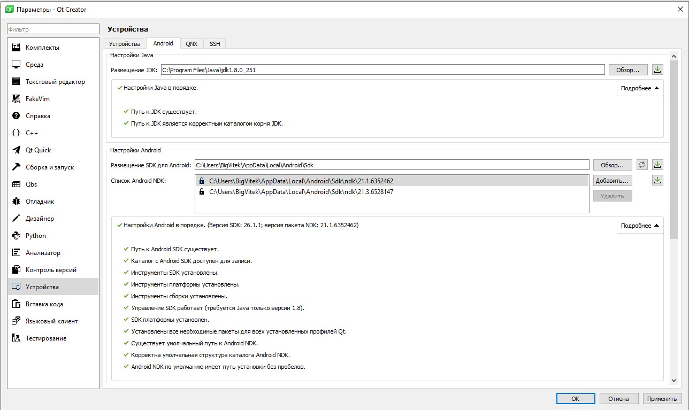
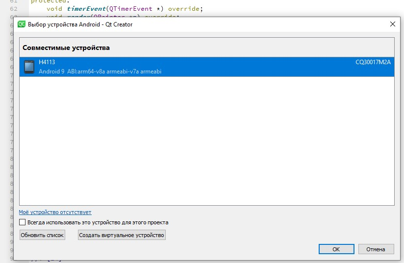

МИНИСТЕРСТВО НАУКИ  И ВЫСШЕГО ОБРАЗОВАНИЯ РОССИЙСКОЙ ФЕДЕРАЦИИ  

Федеральное государственное автономное образовательное учреждение высшего образования  

"КРЫМСКИЙ ФЕДЕРАЛЬНЫЙ УНИВЕРСИТЕТ им. В. И. ВЕРНАДСКОГО"  

ФИЗИКО-ТЕХНИЧЕСКИЙ ИНСТИТУТ  

Кафедра компьютерной инженерии и моделирования

  

​

### Отчёт по лабораторной работе № 8  по дисциплине "Программирование"

 

​

студента 1 курса группы ПИ-б-о-192(1) 

Денисенко Виктора Андреевича

направления подготовки 09.03.04 "Программная инженерия"  

 

​

<table>

<tr><td>Научный руководитель  старший преподаватель кафедры  компьютерной инженерии и моделирования</td>

<td>(оценка)</td>

<td>Чабанов В.В.</td>

</tr>

</table>

  

​

Симферополь, 2020

<h2><b>Цель:</b></h2> 

1. Настроить IDE Qt Creator для разработки приложений под android ОС;

2. Изучить базовые понятия связанные с мобильной разработкой;

3. Научиться создавать мобильные приложения при помощи фреймворка Qt 5.14.

<h2><b>Ход работы</b></h2> 

Настроил Qt для работы с Android

Рисунок 1. Настройка Qt

Для тестовой программы выбрал проект из примеров "Analog Clock", запустил на телефоне.

Рисунок 2-3. Запуск приложения на смартфоне

<h2><b>Вывод</b></h2> 

Настроил IDE Qt Creator для разработки приложений под Android. Изучил базовые понятия связанные с мобильной разработкой. Научился создавать мобильные приложения при помощи фреймворка Qt 5.14.

