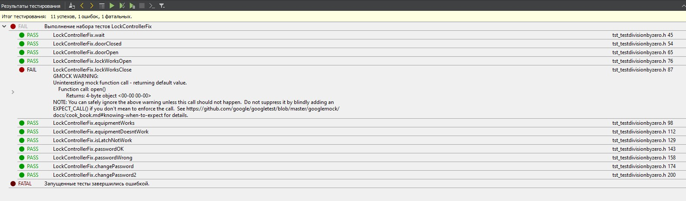
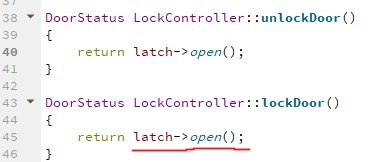

МИНИСТЕРСТВО НАУКИ  И ВЫСШЕГО ОБРАЗОВАНИЯ РОССИЙСКОЙ ФЕДЕРАЦИИ  

Федеральное государственное автономное образовательное учреждение высшего образования  

"КРЫМСКИЙ ФЕДЕРАЛЬНЫЙ УНИВЕРСИТЕТ им. В. И. ВЕРНАДСКОГО"  

ФИЗИКО-ТЕХНИЧЕСКИЙ ИНСТИТУТ  

Кафедра компьютерной инженерии и моделирования

  

​

### Отчёт по лабораторной работе № 9  по дисциплине "Программирование"

 

​

студента 1 курса группы ПИ-б-о-192(1) 

Денисенко Виктора Андреевича

направления подготовки 09.03.04 "Программная инженерия"  

 

​

<table>

<tr><td>Научный руководитель  старший преподаватель кафедры  компьютерной инженерии и моделирования</td>

<td>(оценка)</td>

<td>Чабанов В.В.</td>

</tr>

</table>

  

​

Симферополь, 2020

<h2><b>Цель:</b></h2> 

1. Познакомиться с Google Test и Google Mock Framework;

2. Изучить базовые понятия относящийся к тестированию кода;

3. Научиться тестировать классы в среде разработки Qt Creator.

<h2><b>Ход работы</b></h2> 

Реализовал <a href="cases"> тест-кейсы</a>, получил вывод:

Рисунок 1. Результаты тестирования

Получил ошибку в тесте №5, это происходит из-за того что функция lockDoor() возвращает latch->open(), когда должна возвращать latch->close(). Так как мы проверяем на close() выводится ошибка.

Рисунок 2. Ошибка в unlockDoor()

<h2><b>Вывод</b></h2> 

Познакомился с Google Test и Google Mock Framework, изучил базовые понятия относящиеся к тестированию кода, научился тестировать классы в среде разработки Qt Creator.

